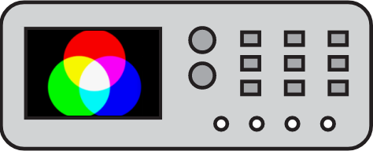

# ColorScope [](https://travis-ci.org/michalkielan/ColorScope) [](https://ci.appveyor.com/project/michalkielan/colorscope/branch/master) [](https://coveralls.io/github/michalkielan/ColorScope?branch=master)




Tool for analyze the image quality

## Requirements
* python-opencv

```
$ sudo pip install opencv-python
```

## Usage
Output format supported: rgb, yuv

```
$ ./colorscope.py -i image.jpeg -out_fmt=rgb
R      G      B
23     24     232
255    255    255
...
```

Raw input images
```
$ ./colorscope.py -i image.yuv -pix_fmt=nv21 -s 640x480 -out_fmt=rgb
```
